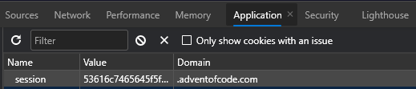

# Introduction

This Python script gets Advent of Code input and writes to a local file.

# Setup

This script was designed to work with standard Python libraries, no `pip install` required.

In order to support all browsers, the cookie must be provided manually. The script
expects the value of the `session` cookie to be located in a file named `cookie`. This
can be any file type.

The **Value** of the cookie can be found on the **Application** tab in Chrome Dev Tools:



# Execution

```
python get_input.py <year> <day>
```

`<year>` and `<day>` represent the year and day of the puzzle input. For example,
to get the input for the first puzzle input for 2020:

```
python get_input.py 2020 1
```

The input will be written to a file named `2020day1.txt`.
